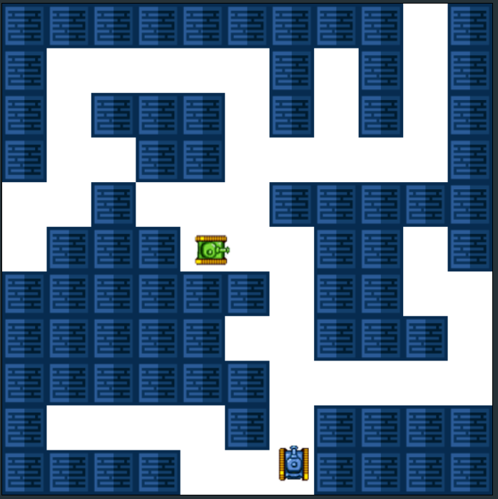

# Tank Game

Welcome to `tank-game`, a fun and interactive multiplayer tank game built with Node.js and HTML canvas!

## Overview

`tank-game` is a live tank game where players control tanks on a grid-based canvas. The game leverages WebSocket communication for real-time interaction, allowing players to move their tanks, shoot projectiles, and engage in exciting battles. Each game features a randomly generated map, adding an element of unpredictability to the gameplay. The game logic is all stored on back-end to avoid transparency and user tampering on console, only the render functionalities are on the front-end.



## Features

- **Live Gameplay**: Experience real-time tank battles with other players.
- **Grid-based Canvas**: The game interface is presented on a grid canvas, providing a strategic and visually appealing environment.
- **Shooting Mechanics**: Tanks can shoot projectiles to attack opponents. Precise aiming and timing are crucial for success.
- **Random Maps**: Every game features a unique map generated randomly, ensuring a fresh and dynamic experience in each session.

## Getting Started

To run `tank-game` on your local machine, follow these steps:

1. Clone the repository:
   ```
   git clone https://github.com/rafieissam/tank-game.git
   ```
2. Navigate to the project directory:
    ```
    cd tank-game
    ```
3. Install dependencies:
    ```
    npm install
    ```
4. Start the server:
    ```
    npm start
    ```
    Open your browser and go to http://localhost:3000 to access the game.

## Gameplay Instructions

- **Controls:** Use arrow keys to navigate your tank.
- **Shooting:** Press the space bar to shoot projectiles.
- **Objective:** Defeat other players and be the last tank standing!